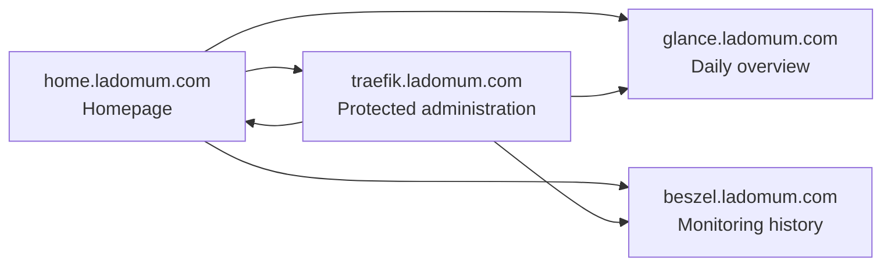

# Domum Control Center

## Roles

- Homepage is the normal entry point and complete HTTPS service directory.
- Glance provides quick links and limited technology feeds.
- Beszel owns detailed Pi, disk, network, and Docker history.
- Traefik routes HTTPS and keeps its dashboard behind basic authentication.
- Healthchecks monitors scheduled job heartbeats, not host resource metrics.

## Adding Services

Add the service to the `service_catalog()` first, then its Compose fragment and
Traefik labels. Add one Homepage card only after its HTTPS route works. Use an
internal `siteMonitor` URL only when Homepage can reach it without credentials.
Add a Glance link only when it supports the daily overview; do not duplicate the
Homepage directory.

## Healthchecks

Create checks in the authenticated Healthchecks UI for backups, restore
verification, recovery-pack creation, and weekly reports. Their UUID/ping URL
is secret. Store each URL in a root-owned file and wire it into the respective
systemd job only after the check exists. Do not use Healthchecks as an HTTP
uptime or metrics platform.

## Rollback

Revert the relevant Git commit, run the normal targeted deployment workflow,
then confirm `docker ps`, `curl -fsS https://home.ladomum.com/`, and the affected
container logs. Never use `docker compose down` for this stack.
